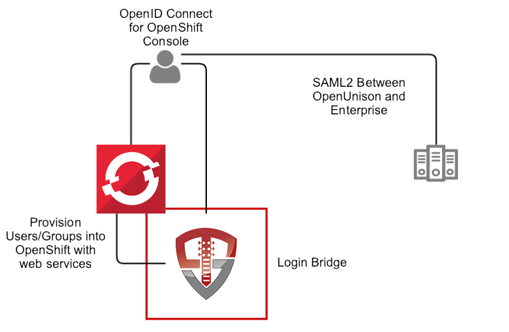

# OpenShift SAML2 Authenticator

This application, built on OpenUnison, provides a simple way to add SAML2 authentication to your OpenShift cluster.  No external database needed.



# Deployment

The deployment model assumes OpenShift 3.x or higher (OKD is supported)

*NOTE* if using the Red Hat certified images, you'll need credentials for Red Hat Connect.

These instructions cover using the Source-to-Image created by Tremolo Security for OpenUnison.  The Source-to-Image builder will build a container image from your unison.xml and myvd.props file that has all of your libraries running a hardened version of Undertow on the latest CentOS or Red Hat Enterprise Linux.  The keystore required for deployment will be stored as a secret in OpenShift.


## Create Environments File

OpenUnison stores environment specific information, such as host names, passwords, etc, in a properties file that will then be loaded by OpenUnison and merged with its configruation.  This file will be stored in Kubernetes as a secret then accessed by OpenUnison on startup to fill in the `#[]` parameters in `unison.xml` and `myvd.conf`.  For instance the parameter `#[OU_HOST]` in `unison.xml` would have an entry in this file.  Below is an example file:

```properties
BUILDER_IMAGE=tremolosecurity/openunisons2idocker
OPENSHIFT_CONSOLE_URL=https://openshift.tslocal.lan:8443/console
OU_CERT_C=US
OU_CERT_L=Alexandria
OU_CERT_O=Tremolo Security
OU_CERT_ST=Virginia
OU_HOST=openunison.apps.tslocal.lan
OU_OIDC_OPENSHIFT_REIDRECT=https://openshift.tslocal.lan:8443/oauth2callback/openunison
OU_OIDC_OPENSHIFT_SECRET=start123
REG_CRED_PASSWORD=XXXXX
REG_CRED_USER=XXXXX
SESSION_INACTIVITY_TIMEOUT_SECONDS=900
unisonKeystorePassword=start123
```

*Detailed Description or Properties*

| Property | Description |
| -------- | ----------- |
| OU_HOST  | The host name for OpenUnison.  This is what user's will put into their browser to login to Kubernetes |
| OU_CERT_OU | The `OU` attribute for the forward facing certificate |
| OU_CERT_O | The `O` attribute for the forward facing certificate |
| OU_CERT_L | The `L` attribute for the forward facing certificate |
| OU_CERT_ST | The `ST` attribute for the forward facing certificate |
| OU_CERT_C | The `C` attribute for the forward facing certificate |
| unisonKeystorePassword | The password for OpenUnison's keystore |
| SESSION_INACTIVITY_TIMEOUT_SECONDS | The number of seconds of inactivity before the session is terminated, also the length of the refresh token's session |
| BUILDER_IMAGE | The name of the image used to build OpenUnison.  This image can be eiter the CentOS 7 based image on dockerhub, or an image from a privare respository.  If wanting to use the Red Hat certified image, use `registry.connect.redhat.com/tremolosecurity/openunison-s2i-10` |
| OPENSHIFT_CONSOLE_URL | The URL for the OpenShift cluster's console.  Usually `https://host.domain/console/` |
| OU_OIDC_OPENSHIFT_REIDRECT | Redirect back to OpenShift to finish the signin process, usually the same host as the console with the path `/oauth2callback/openunison` |
| OU_OIDC_OPENSHIFT_SECRET | A shared secret between OpenShift and OpenUnison to complete authentication |
| REG_CRED_USER | Username for a private registry (such as registry.connect.redhat.com) |
| REG_CRED_PASSWORD | Password for a private registry (such as registryion.connect.redhat.com) |

Store these parameters in a file called `input.props`.

## Prepare Deployment

Perform these steps from a location with a working `kubectl` configuration:

1. Create a directory for secrets to store `input.props`, ie `/path/to/secrets` and put `input.props` in that directory
2. Create a directory for configmaps, ie `/path/to/configmaps`, and copy the metadata from your SAML2 identity provider to `/path/to/configmaps/saml2-metadata.xml`

## Deployment

Based on where you put the files from `Prepare Deployment`, run the following:

```
curl https://raw.githubusercontent.com/TremoloSecurity/kubernetes-artifact-deployment/master/src/main/bash/deploy_openunison.sh | bash -s /path/to/configmaps /path/to/secrets https://raw.githubusercontent.com/OpenUnison/openunison-openshift-login-saml2/master/src/main/yaml/artifact-deployment.yaml
```

The output will look like:

```
namespace/openunison-deploy created
configmap/extracerts created
secret/input created
clusterrolebinding.rbac.authorization.k8s.io/artifact-deployment created
job.batch/artifact-deployment created
NAME                        READY     STATUS    RESTARTS   AGE
artifact-deployment-jzmnr   0/1       Pending   0          0s
artifact-deployment-jzmnr   0/1       Pending   0         0s
artifact-deployment-jzmnr   0/1       ContainerCreating   0         0s
artifact-deployment-jzmnr   1/1       Running   0         4s
artifact-deployment-jzmnr   0/1       Completed   0         15s
```

Once you see `Completed`, you can exit the script (`Ctl+C`).  This script creates all of the appropriate objects in Kubernetes, signs certificates and deploys both OpenUnison and the Dashboard.  

## Complete Integration with your Identity Provider

Run `kubectl describe configmap api-server-config -n openunison` to get the metadata for your identity provider.  Import it into your identity provider and add the following attributes to the assertion so OpenUnison knows how the logged in uers is:

| Attribute Name | Active Directory Attribute | Description |
| -------------- | -------------------------- | ----------- |
| uid            | samAccountName             | User's login id |
| givenName      | givenName                  | User's first name |

If using Active Directory Federation Services, you can use the following claims transformation rule:
```
c:[Type == "http://schemas.microsoft.com/ws/2008/06/identity/claims/windowsaccountname", Issuer == "AD AUTHORITY"]
 => issue(store = "Active Directory", types = ("http://schemas.xmlsoap.org/ws/2005/05/identity/claims/nameidentifier", "uid", "cn"), query = ";sAMAccountName,sAMAccountName,cn;{0}", param = c.Value);
```

Once the metadata is imported and the attributes are added, you are ready to login to OpenUnison.


## Building OpenUnison

Once deployed, OpenShift will start building OpenUnison.  You can check the build process (depending on your internet connection) by running  `oc get builds`.  Once OpenUnison is running, you can proceed to the `First Login to OpenShift Identity Manager`

## Enable SSO with OpenShift Console
Next update the `projectRequestMessage` parameter in `master-config.yaml` with a message to users telling them how to request projects such as **To request a new project click on the New OpenShift Project badge in OpenUnison**.

Finally, configure SSO per the instructions in the `api-server-config` configmap in the `openunison` project.  *NOTE:* make sure to set the `clientSecret` attribute for your cluster.

# Just-In-Time Provisioning from a SAML2 Assertion

If you store your groups in the directory tied to your identity provider (as an example Active Directory), you can use OpenUnison to update OpenShift's groups based on these groups on each login.  As new groups come in (or are removed) OpenUnison will keep OpenShift's group memberships in sync.  In order to enable this feature:

1.  Fork this repository
2.  Edit `src/main/webapp/WEB-INF/workflows/10-jitdb.xml`
3.  Once the workflow is updated according to your needs, commit and push to your remote repository
4.  Update the `openunison` `BuildConfig` in the `openunison` namespace to point to your git repository intead of the main one

Once OpenUnison is rebuilt, you'll have a working JIT provisioning system without having to setup synchronization jobs.


# Whats next?
Now you can begin mapping OpenUnison's capabilities to your business and compliance needs.  For instance you can add multi-factor authentication with TOTP or U2F, Create privileged workflows for onboarding, scheduled workflows that will deprovision users, etc.
